# Cabin VLM Benchmark — 车外数据线技术报告

**项目**：B08 Visteon#1 Cabin Vision Dataset Curation
**模块**：Category 2 / Exterior（车外）数据线
**版本**：2026-06-16

---

> **文档发布说明（发布前删除本段）**
> 本文档已用真实图片引用，在本地 Markdown 预览（VSCode / Typora）中可直接看到全部 14 张图。图片文件位于同目录 `语雀上传附件/图片/`。
> **上传语雀的两种方式**（任选其一）：
> - **方式 A（推荐，图随文走）**：用 Typora 打开本文件 → 全选「渲染后的预览」→ 复制 → 粘贴进语雀，图片会随剪贴板自动上传。
> - **方式 B（导入）**：语雀「新建文档 > 导入 > Markdown」选本文件，再把 `语雀上传附件/图片/` 内同名图一并上传。
> 若直接复制 Markdown 源码粘贴，本地相对路径图在语雀里仍不显示——语雀读不到你电脑的文件，需按上面方式让图片上传。完整附件清单见附录 A。

---

## 摘要

本数据线面向智能座舱视觉语言模型（VLM），构建覆盖车外八类用例的**多模态训练数据集、微调模型与评测体系**。当前累计 8,030 图文对、约 34,578 条问答，统一采用 sharegpt 训练格式。在 200 张冻结测试集上完成多版本客观评测，车型识别准确率由基线 5% 提升至 80%，并在此基础上引入 GT 接地 caption 与 VLA 思维链 caption 两项方法以增强车外场景的领域知识与驾驶决策能力。

---

## 1. 数据集规模

| 指标 | 数值 |
|---|---|
| 图文对（图）| 8,030 |
| GT 接地 caption | 2,424（nuScenes 标注接地，零幻觉）|
| VLA CoT caption | 2,424（6 相机思维链，详见第 5 节）|
| 问答总数 | 约 34,578 |
| 数据源 | 5 个，覆盖车外 8 类 |
| 数据切分 | 均衡训练 5,538 + 冻结测试集 200（每类 40，不参与训练）|
| 训练格式 | sharegpt |

**数据源构成**：nuScenes 2,258 · Stanford Cars 1,997（196 类）· GTSRB 1,497（43 类）· TextVQA 1,500 · SUN397 778
**能力分布**：Recognition 10,123 · Reasoning 3,704 · WorldKnowledge 2,071

---

## 2. 数据集概览

### 2.1 多样性总览

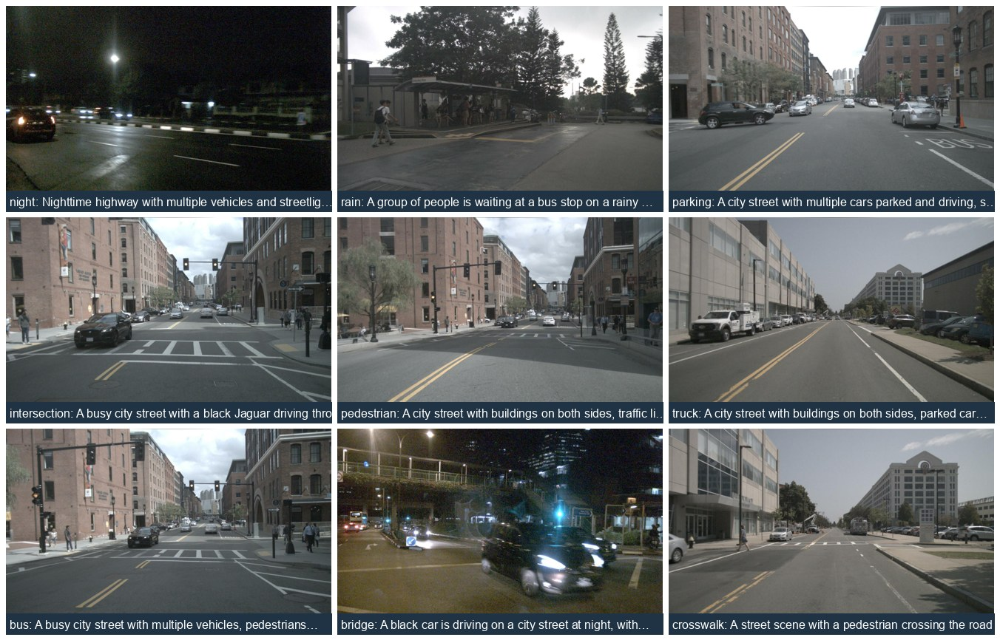

*nuScenes 真实驾驶场景：夜间、雨天、停车、路口、行人、卡车、公交、桥梁、斑马线。*

### 2.2 规模总览（每源 48 张缩略图）

**车外场景 nuScenes（6 相机，日夜多场景）**
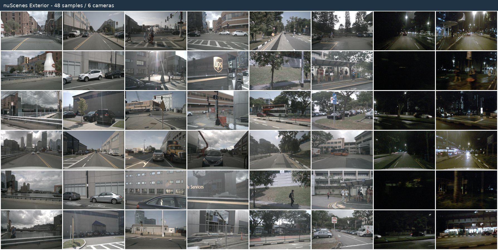

**车型 Stanford Cars（跨 196 类）**
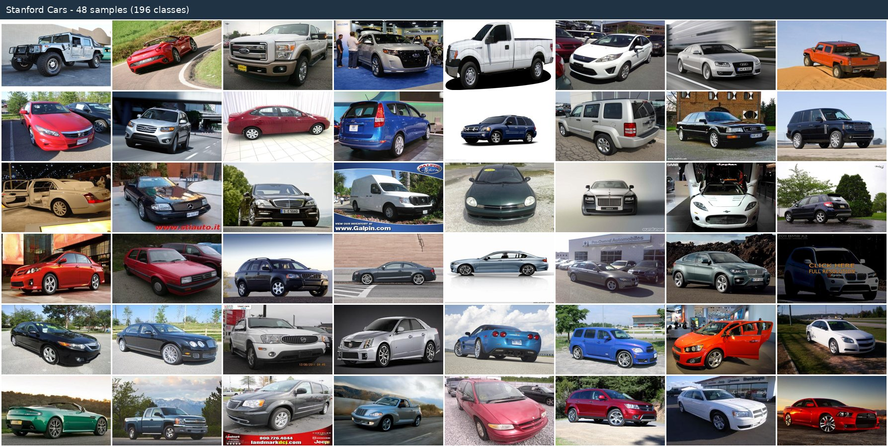

**交通标志 GTSRB（跨 43 类）**
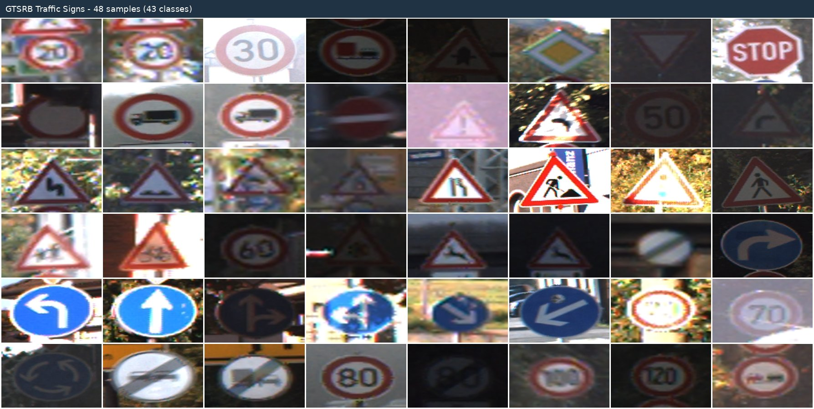

**自然景观 SUN397**
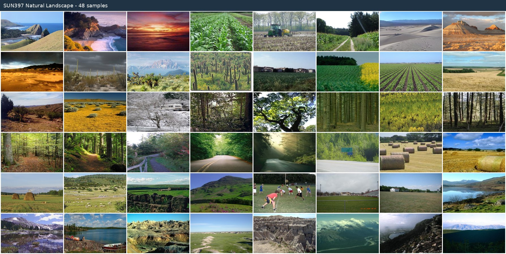

**文字/广告 OCR TextVQA**
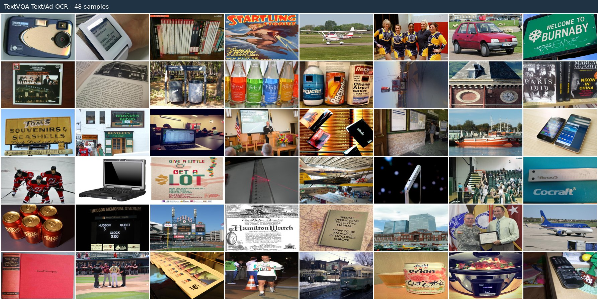

### 2.3 逐类样例

**① 车外场景 Exterior Scene（nuScenes，caption + VQA）**
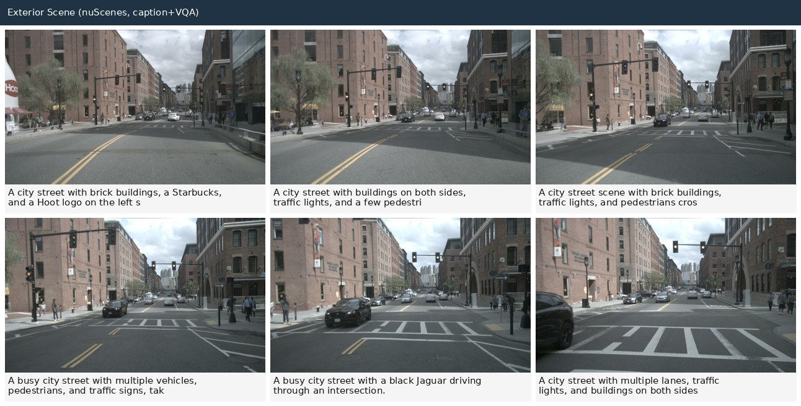

**② 车型识别 Vehicle Make & Model（Stanford Cars，196 类，标签引导）**
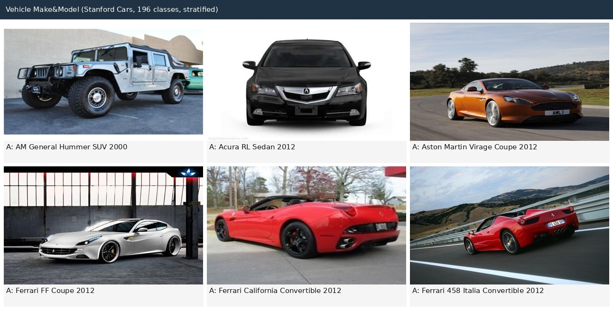
真值标签注入后答案准确率达 100%（如 "AM General Hummer SUV 2000"），消除 "Unknown" 输出。

**③ 交通标志 Traffic Sign（GTSRB，43 类，标签引导）**
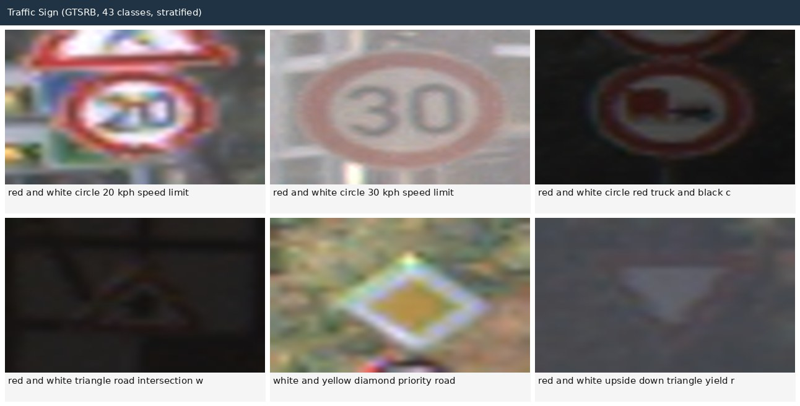
覆盖限速、禁令、警告、优先、让行等全类标志。

**④ 自然景观 Natural Landscape（SUN397，标签引导）**
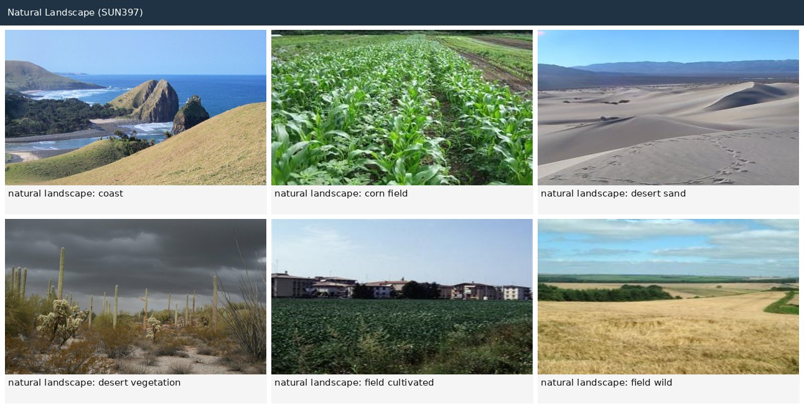

**⑤ 文字/广告 OCR（TextVQA，图中文字识别）**
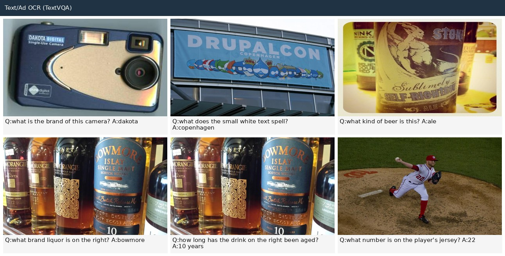

**⑥ GT 接地 caption（nuScenes 标注：精确计数 + 距离，零幻觉）**
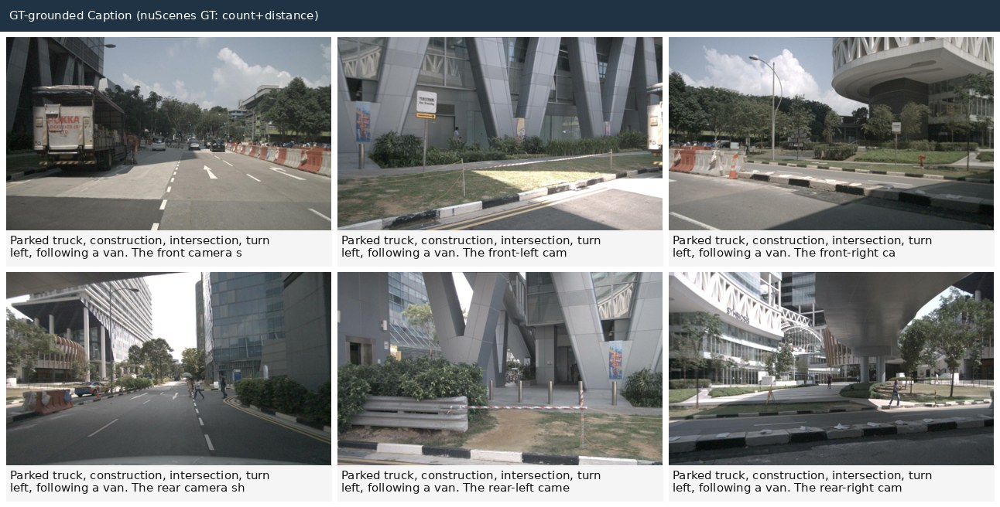
基于 nuScenes 检测标注（类别 + 3D 框位置 + 距离）生成，示例：*"front camera 内 6 行人、3 车、1 卡车 ≤40m，最近行人正前方约 12.7m"*，用于 caption 知识注入。

---

## 3. 方法

| 方法 | 说明 |
|---|---|
| 标签引导 recaption | 真值标签注入 prompt，保证答案正确（车型 5%→80% 的关键）|
| GT 接地 caption | 基于 nuScenes 标注（物体/数量/位置/距离）+ 场景描述生成 100% 准确 caption |
| VLA CoT caption | 思维链「交通要素 → 风险 → 驾驶判断」+ 摄像头映射（详见第 5 节）|
| POI RAG | 图像 → VLM 提取店招 → Wikipedia 检索 → 整合回答 |
| 冻结测试集评测 | 固定 200 张测试集，多版本同集对比，保证客观可比 |

---

## 4. 评测结果（冻结测试集，客观准确率）

| 类别 | base | v1 | v3（全才）| v4 | Qwen3-VL-4B |
|---|---|---|---|---|---|
| 车型 make/model | 5% | 80% | 60% | 67.5% | 10% |
| 交通标志 | 92.5% | 100% | 100% | 100% | 75% |
| 自然景观 | 60% | 77.5% | 82.5% | 80% | 90% |
| 文字 OCR | 82.5% | 77.5% | 82.5% | 77.5% | 82.5% |
| 车外场景（judge 1–10）| 7.58 | 8.0 | 7.92 | 7.95 | 7.75 |

**结论**：v3 为当前综合最优模型（各类均衡、覆盖最全），v1 为车型专家。实验观测到多任务 LoRA 存在能力互斥现象（车型与 OCR 竞争模型容量）。

**训练曲线**
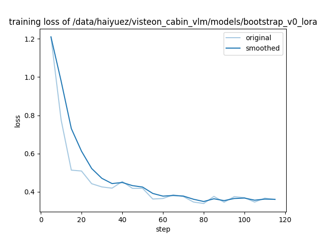
*bootstrap LoRA 训练 loss（Qwen2.5-VL-7B，rank 8，2 epoch）。*

---

## 5. VLA CoT caption 数据线

### 5.1 设计目标

车外 caption 优先级高于 QA，采用 **VLA 思维链**范式：交通要素（红绿灯/路牌/行人）→ 风险分析 → 驾驶判断，并结合整体场景描述，以服务驾驶决策为核心。

### 5.2 摄像头映射

| 相机 | 关注任务 |
|---|---|
| 前视 | stop-go 决策、交通灯与路牌、前方行人 |
| 侧视 | 变道安全、盲区车辆 |
| 后视 | 后方来车、是否可倒车/让行 |

### 5.3 生成方法与样例

基于 nuScenes GT 物体接地 + 6 相机角色映射，生成三段式思维链 caption。示例（前视相机，GT：6 行人 / 3 车 / 1 卡车）：

> **Scene:** A city street with a parked truck on the left, a construction barrier on the right, several vehicles and pedestrians; the road has lane markings and a pedestrian crossing; weather clear.
> **Risk:** Risk of pedestrians crossing ahead; the parked truck may obstruct view of the intersection; possible vehicles cutting in from the right.
> **Decision:** Proceed with caution, slow down approaching the crossing, be ready to stop to let pedestrians cross.

每张图额外生成多元化 QA（Recognition / Reasoning / Decision 各一），统一输出 sharegpt 格式。

### 5.4 数据规模与质量

| 指标 | 数值 |
|---|---|
| CoT 样本数 | 2,424 |
| 相机覆盖 | 6 相机各 404 张（前/前左/前右/后/后左/后右，完全均衡）|
| 三段式合规率（Scene/Risk/Decision）| 100% |
| 含多元化 QA 比例 | 92.7%（平均 7.6 轮/样本）|
| 接地方式 | nuScenes GT 物体（类别/数量/位置/距离）|

**三相机思维链对照（前视 / 侧视 / 后视）**
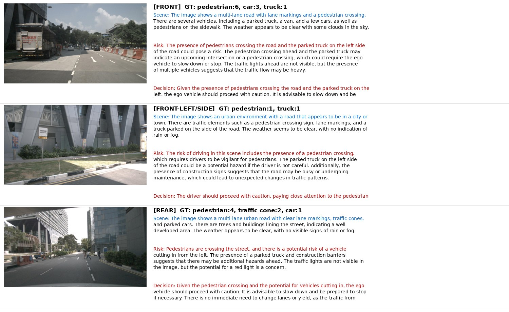
*同一驾驶时刻不同相机的思维链：前视关注 stop-go 与前方行人，侧视关注变道盲区，后视关注后方来车。*

该数据线合入后将训练 v6，用于验证 caption 优先策略的增益。

---

## 6. 数据格式

**训练格式（sharegpt）**
```json
{"conversations":[
  {"from":"human","value":"<image>\nIdentify the vehicle in this image."},
  {"from":"gpt","value":"A silver AM General Hummer SUV 2000 ..."},
  {"from":"human","value":"What is the make and model of this vehicle?"},
  {"from":"gpt","value":"AM General Hummer SUV 2000"}],
 "images":["/.../stanford_cars/images/00000.jpg"]}
```

**VLA CoT caption（车外，三段式）**
```json
{"conversations":[
  {"from":"human","value":"<image>\nDescribe this exterior driving scene and give a driving decision."},
  {"from":"gpt","value":"Scene: ... Risk: ... Decision: ..."},
  {"from":"human","value":"How many pedestrians are crossing ahead?"},
  {"from":"gpt","value":"Six pedestrians within 40m."}],
 "images":["/.../nuscenes/.../CAM_FRONT/xxx.jpg"]}
```

**质检格式（raw jsonl）**：`{image, camera, gt, caption, qa:[{question, answer, capability, use_case}]}`

---

## 7. 用例覆盖

行人、场景描述、建筑、车型（80%）、交通标志（100%）、文字 OCR、自然景观、POI（RAG）——车外 8 类全覆盖。

---

## 8. 演示

```bash
ssh haiyuez@10.136.20.188   # 需校园 VPN
conda activate /data/haiyuez/visteon_cabin_vlm/envs/llamafactory
export PYTHONNOUSERSITE=1 CUDA_VISIBLE_DEVICES=<空闲卡> DEMO_MODEL=/data/haiyuez/visteon_cabin_vlm/models/bootstrap_v3_merged
python /data/haiyuez/visteon_cabin_vlm/code/gradio_demo.py   # 浏览器访问 :7860，上传图像 → 模型识别 + 问答
```

---

## 9. 已知局限

- GTSRB 早期子集类别偏少，已分层重采样至 43 类全覆盖；多样化子集的重训练为后续工作。
- 多任务 LoRA 存在能力互斥（车型 vs OCR），单模型难以全类最优。
- nuScenes 等数据集为非商业许可，最终交付边界需与 Visteon 确认。

---

## 附录 A — 附件清单

**图片附件**
| 用途 | 文件 |
|---|---|
| 9 场景总览 | `demo_package/preview_grid_9.jpg` |
| nuScenes 缩略图 | `demo_package/contact_sheets/contact_nuscenes.jpg` |
| 车型缩略图 | `demo_package/contact_sheets/contact_cars.jpg` |
| 标志缩略图 | `demo_package/contact_sheets/contact_signs.jpg` |
| 景观缩略图 | `demo_package/contact_sheets/contact_landscape.jpg` |
| OCR 缩略图 | `demo_package/contact_sheets/contact_ocr.jpg` |
| 车外场景拼图 | `demo_package/cat_exterior.jpg` |
| 车型拼图 | `demo_package/cat_cars.jpg` |
| 标志拼图 | `demo_package/cat_signs.jpg` |
| 景观拼图 | `demo_package/cat_landscape.jpg` |
| OCR 拼图 | `demo_package/cat_ocr.jpg` |
| GT caption 拼图 | `demo_package/cat_gtcaption.jpg` |
| 三相机 CoT 对照 | `demo_package/cot_3cam_montage.jpg` |
| 训练 loss 曲线 | `results/training_loss.png` |

**数据文件附件**
| 用途 | 文件 |
|---|---|
| sharegpt 字段定义 | `SHAREGPT_FORMAT_SPEC.md` |
| 数据集卡片 | `08_Dataset_Card.md` |
| 核心实验结果 | `09_Results_FrozenEval.md` |
| 样例记录（120 条）| `demo_package/sample_records_120.jsonl` |
| CoT 样例记录（30 条）| `results/cot_sample_30.jsonl` |
| 车外训练数据 | `results/exterior_full_sharegpt.json` |
